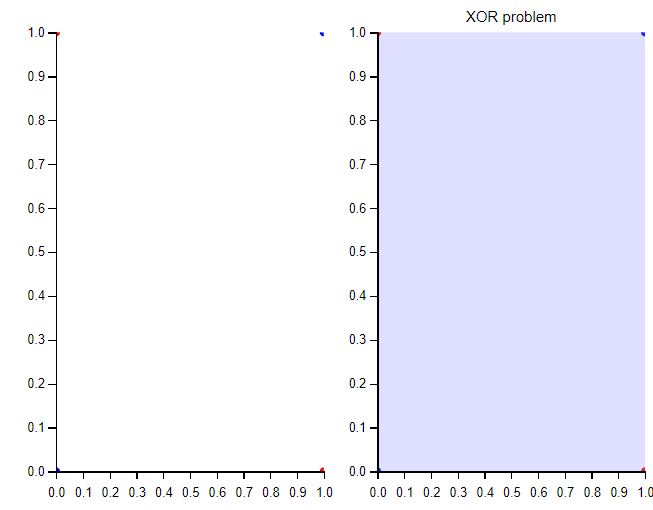

# Perceptron

## Português

A humanidade sempre sonhou com a ideia de máquinas que pudessem realizar tarefas
sem a necessidade de manipulação humana e com total autonomia, dessa forma, durante o século 19,
especialmente após a metade do mesmo, as pesquisas de modelos matemáticos capazes fazer com que as
máquinas aprendessem tiveram grande desenvolviment, boa parte dos algoritmos clássicos surgiu nessa época,
dentre eles existe o Perceptron, um neurônio artificial, cuja a proposta seria a de modelar como um de nossos
neurônios é capaz de aprender sobre o mundo ao seu redor, um modelo bio-inspirado que seria capaz de resolver diversos
problemas.


O Perceptron é um classificador binário linear, dessa forma, só é capaz de resolver problemas linearmente separáveis,
sua ideia básica consiste em simular as sinapses cerebrais, simulando as mesmas a partir de uma multiplicação de pesos
por cada uma de suas entradas, e somando todos esses resultados e adicionando um valor, após isso o resultado é enviado
para uma função de ativação que é responsável por avaliar a intensidade da saída e dizer a qual classe pertence a amostra.

Os neurônios humanos funcionam de forma parecida, ou seja, recebem diversos sinais elétricos(sinapses) de seus vizinhos,
processam todas essas entradas e devolvem um sinal elétrico com maior ou menor intensidade que os originais.


O algoritmo básico do Perceptron funciona da seguinte forma:

1. Inicialize os pesos de maneira aleatória
2. Realize a multiplicação de cada elemento da amostra X por um peso W
3. Calcule a ativação do passo 2
4. Calcule o erro
5. Atualize os pesos
6. Repita a partir de 1 para todas as outras amostras

A seguir um simples código python para a realização desses passos

```python
combination = np.dot(X, W) + bias # Combinação Linear
answer = np.where(combination > 0, 1, 0) # Ativação step function
loss_function += correct[i] - answer # Calculando o erro
self.weights[j] = self.weights[j] + (self.learning_rate * self.loss_function * entry[j]) # Ajuste de pesos
self.bias += self.loss_function * self.learning_rate # Atualização do bias
```

A seguir um exemplo de classificação com o Perceptron.


Para problemas como esse, onde temos um problema linearmente separável, o Perceptron se adequa bem, no entanto,
quando temos problemas que uma reta não consegue resolver, como o XOR(Ou exclusivo), o Perceptron não consegue encontrar
uma solução que resolva o problema, vamos visualizar isso.



O perceptron foi incapaz de realizar a divisão correta desse espaço, no entanto uma junção de diversos neurônios é capaz de
encontrar uma resolução plausível para esse problema, veremos no módulo de rede neural.

## English

Humanity has always dreamed of the idea of machines that could perform tasks
without the need for human manipulation and with total autonomy, thus, during the 19th century,
especially after half of it, research into mathematical models capable of making
learning machines had great development, most of the classic algorithms emerged at that time,
Among them there is the Perceptron, an artificial neuron, which the proposal would be to model as one of our
neurons is capable of learning about the world around them, a bio-inspired model that would be able to solve several
problems.


Perceptron is a linear binary classifier, therefore, it is only capable of solving linearly separable problems,
its basic idea consists of simulating brain synapses, simulating them based on a multiplication of weights
for each of its inputs, and adding all these results and adding a value, after which the result is sent
for an activation function that is responsible for evaluating the intensity of the output and saying which class the sample belongs to.

Human neurons work in a similar way, that is, they receive several electrical signals (synapses) from their neighbors,
they process all these inputs and return an electrical signal with greater or lesser intensity than the original ones.


The basic Perceptron algorithm works as follows:

1. Initialize the weights randomly
2. Multiply each sample element X by a weight W
3. Calculate activation from step 2
4. Calculate the error
5. Update the weights
6. Repeat from 1 for all other samples

Below is a simple python code to perform these steps

```python
combination = np.dot(X, W) + bias # Dot product
answer = np.where(combination > 0, 1, 0) # Step function activation
loss_function += correct[i] - answer # Error calculation
self.weights[j] = self.weights[j] + (self.learning_rate * self.loss_function * entry[j]) # Weights adjustment
self.bias += self.loss_function * self.learning_rate # Bias update
```

Below is an example of classification with Perceptron.


For problems like this, where we have a linearly separable problem, Perceptron is well suited, however,
when we have problems that a straight line cannot solve, such as XOR(Or exclusive), Perceptron cannot find
a solution that solves the problem, let's visualize this.


The perceptron was unable to correctly divide this space, however a junction of several neurons is capable of
find a plausible resolution to this problem, we will see in the neural network module.
